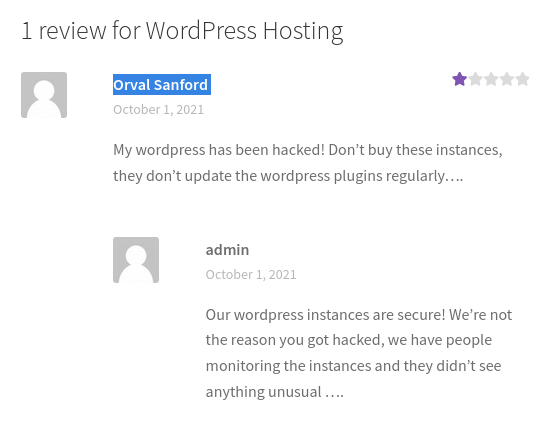
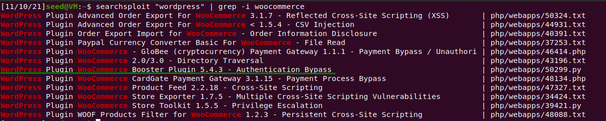
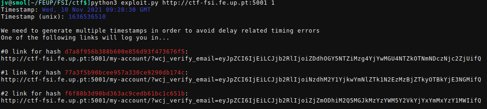

## CTF 1 - Wordpress

- [ctf-fsi.fe.up:5001](http://ctf-fsi.fe.up.pt:5001)

### Versions

After navigating a bit on the website we find an additional information tab

- Wordpress version 5.8.1
- WooComerce plugin 5.7.1
- Booster for WooComerce plugin 5.4.3


### Users

We can also see possible usernames on "recent comments"



- admin
- Orval Sanford

### Vulnerability

Searching for vulnerabilities wordpress itself doesn't seem to have any known exploits.
Looking at the plugins from WooComerce one of them seems promising.
It has the same version as the WooComerce Booster Plugin (5.4.3)
Since it's an authentication bypass we should be able to view private files
once we run it



On exploit-db we can identify the CVE number


- WordPress Plugin WooCommerce Booster Plugin 5.4.3 - Authentication Bypass
- CVE-2021-34346

### Exploiting

```sh
# the last argument 1 is the admin user
# this was confirmed after accessing 
# https://ctf-fsi.fe.up.pt:5001/wp-json/wp/v2/users/1
python3 exploit.py http:ctf-fsi.fe.up.pt:5001 1
```



After running the exploit we are given 3 links, after trying the second one
returned a message of authentication success
Accessing the link we find a forum with a private message on it containing the
last flag
