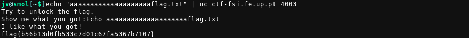
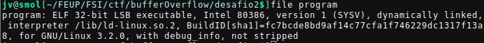
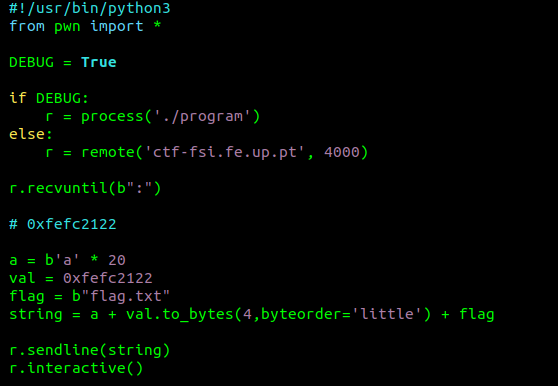
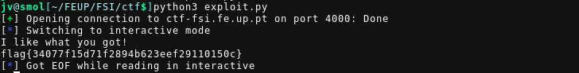

## CTF 2 - Buffer Overflow

- [ctf-fsi.fe.up:4003](http://ctf-fsi.fe.up.pt:4003)
- [ctf-fsi.fe.up:4000](http://ctf-fsi.fe.up.pt:4000)

### Challenge 1

```c
#include <stdio.h>
#include <stdlib.h>

int main() {
    char meme_file[8] = "mem.txt\0";
    char buffer[20];

    printf("Try to unlock the flag.\n");
    printf("Show me what you got:");
    fflush(stdout);
    scanf("%28s", &buffer);

    printf("Echo %s\n", buffer);

    printf("I like what you got!\n");
    
    FILE *fd = fopen(meme_file,"r");
    
    while(1){
        if(fd != NULL && fgets(buffer, 20, fd) != NULL) {
            printf("%s", buffer);
        } else {
            break;
        }
    }


    fflush(stdout);
    
    return 0;
}

```

#### Questões

- Existe algum ficheiro que é aberto e lido pelo programa?

Podemos verificar que existe o nome de um ficheiro de texto a ser guardado num
array "meme\_file". Este ficheiro é aberto algumas linhas depois com uma
chamada a "fopen".

```c
char meme_file[8] = "mem.txt\0";

// ...

FILE *fd = fopen(meme_file,"r");
```

- Existe alguma forma de controlar o ficheiro que é aberto?

Sim, para controlar o ficheiro que é aberto é necessário modificar o array
"meme\_file" com o nome de outro ficheiro. Isto implicaria reescrever na região
de memória em que este array está guardado de alguma forma.

- Existe algum buffer-overflow? Se sim, o que é que podes fazer?

Sim, este buffer overflow ocorre nas seguintes linhas de código

```c
char meme_file[8] = "mem.txt\0";
char buffer[20];

// overflow para meme_file
scanf("%28s", &buffer);
```

O overflow ocorre na chamada a "scanf", como podem ser lidos 28 caracteres
(format string "%28s"), os primeiros 20 ocupam o buffer, no entanto o restantes
fazem overflow para a zona acima na stack. Neste caso exatamente acima do
buffer temos o array "meme\_file".  Ao enviar quaisquer 20 caracteres seguidos
de "flag.txt" reescrevemos "meme\_file" e o ficheiro aberto é flag, sendo o seu
conteúdo exposto através da chamada a "printf"

Este buffer oveflow pode, por exemplo ser explorado da seguinte forma:



### Challenge 2

```c
#include <stdio.h>
#include <stdlib.h>

int main() {
    char meme_file[8] = "mem.txt\0";
    char val[4] = "\xef\xbe\xad\xde";
    char buffer[20];

    printf("Try to unlock the flag.\n");
    printf("Show me what you got:");
    fflush(stdout);
    scanf("%32s", &buffer);
    if(*(long*)val == 0xfefc2122) {
        printf("I like what you got!\n");
        
        FILE *fd = fopen(meme_file,"r");
        
        while(1){
            if(fd != NULL && fgets(buffer, 20, fd) != NULL) {
                printf("%s", buffer);
            } else {
                break;
            }
        }
    } else {
        printf("You gave me this %s and the value was %p. Disqualified!\n", meme_file, *(long*)val);
    }

    fflush(stdout);
    
    return 0;
}

```

#### Questões

- Que alterações foram feitas?

Foi adicionada uma nova variável, um array "val" com um 4 bytes de memória
alocada. Este array é inicializado com o valor em hexadecimal 0xefbeadde. O
excerto de código que abre o ficheiro agora é efetuado caso se verifique a
condição:

```c
if(*(long*)val == 0xfefc2122)
```

A string de formatação do scanf foi também modificada para ler 32 caracteres
"%32s"

- Mitigam na totalidade o problema?

Não, o problema de overflow continua a ocorrer, tanto "meme\_file" como o "val"
podem ser reescritos caso a string recebida por scanf seja superior a 20
caracteres. No entanto, agora, só é possível controlar o ficheiro que é aberto
caso o valor de val seja modificado para 0xfefc2122.

- É possivel ultrapassar a mitigação usando uma técnica similar à que foi
  utilizada anteriormente?

Sim, a técnica utilizada é a mesma, mas temos mais 1 variável a ter em conta.
Olhando para a declaração inicial dos arrays temos:

```c
char meme_file[8] = "mem.txt\0";
char val[4] = "\xef\xbe\xad\xde";
char buffer[20];
```

Estas variáveis, como o programa foi compilado sem medidas de mitigação contra
buffer overflows, encontram-se exatamente por esta ordem. Com buffer a ocupar o
endereço mais baixo (topo da stack), meme\_file no endereço mais alto e val
entre os dois. Seguindo a lógica do desafio anterior, preenchemos a string
enviada para o buffer com 20 caracteres quaisquer, seguidos do endereço que
queremos escrever em val (0xfefc2122). Depois de val voltamos a fazer overwrite
de "mem.txt\0" por "flag.txt" em meme\_file. O valor em hexadecimal é escrito
em little endian, visto que temos um programa compilado para arquitetura x86



Este foi o código usado desta vez:



Ao ser executado, obtemos o valor da segunda flag


