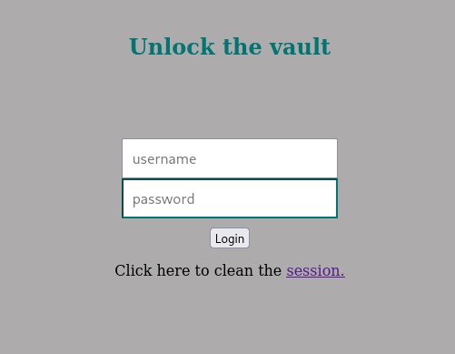
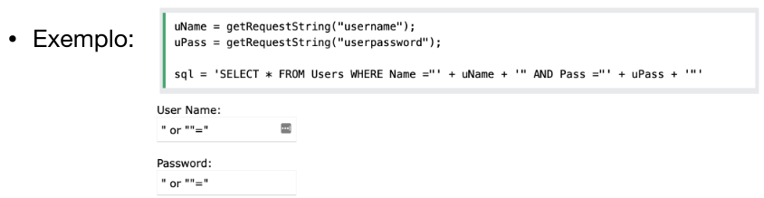
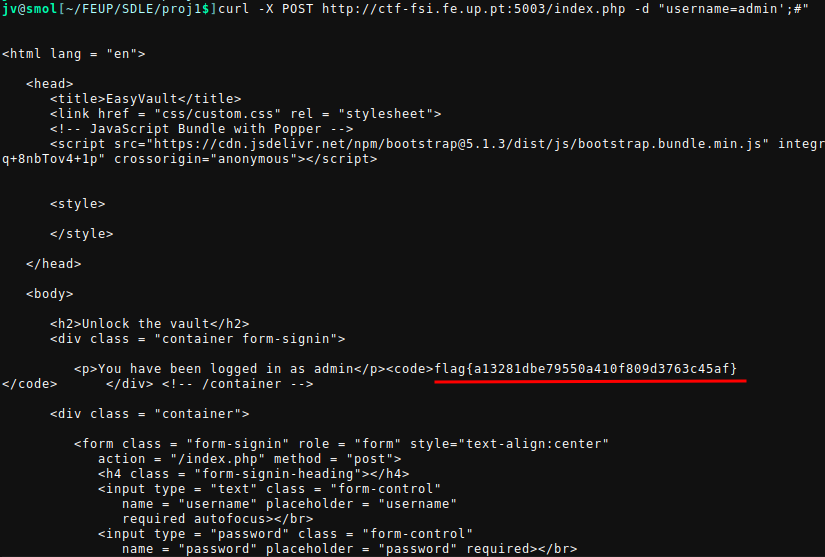
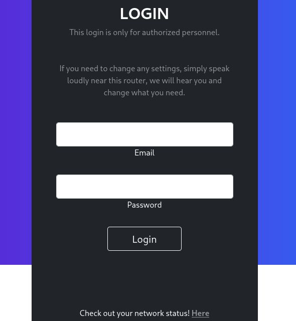
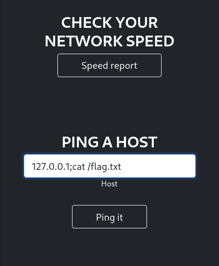
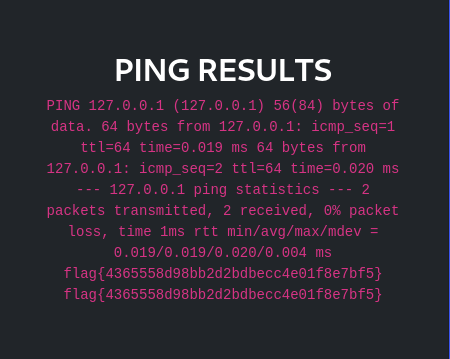

## CTF 7/8 - SQL Injection

- [ctf-fsi.fe.up:5003](http://ctf-fsi.fe.up.pt:5003)
- [ctf-fsi.fe.up:5000](http://ctf-fsi.fe.up.pt:5000)

### Challenge 1



Após aceder ao link temos uma simples página de login com campos para username
e password. Neste caso o que queremos é, de alguma forma, sem saber qualquer
credencial, fazer login no sistema como o utilizador **admin**.

Foi-nos também fornecido o código usado no index.php:

```php
# Código relativo à autenticação de um utilizador

if (!empty($_POST)) {

   require_once 'config.php';

   $username = $_POST['username'];
   $password = $_POST['password'];
   
   $query = "SELECT username FROM user WHERE username = '".$username."' AND password = '".$password."'";
                         
   if ($result = $conn->query($query)) {
                      
      while ($data = $result->fetchArray(SQLITE3_ASSOC)) {
        $_SESSION['username'] = $data['username'];

        echo "<p>You have been logged in as {$_SESSION['username']}</p><code>";
        include "/flag.txt";
        echo "</code>";

     }
   } else {            
       // falhou o login
       echo "<p>Invalid username or password <a href=\"index.php\">Tente novamente</a></p>";
   }
}
```

Recordando as vulnerabilidades web mencionadas nas aulas teóricas:

- CSRF (Cross Site Request Forgery)
- Injeção de Comandos
- SQL Injection
- XSS (Cross Site Scripting)

Podemos verificar que a sanitização do input do utilizador não é feita de forma
segura. Mais concretamente a query enviada para a base de dados é feita através
de concatenações de strings, sem qualquer outra verificação/sanitização. Como o
username e password são controlados pelo utilizador, este pode manipular a
query enviada à base de dados. Temos então uma vulnerabilidade de SQL Injection.

Um exemplo dado na aula teórica muito semelhante à query deste desafio:



Ao adaptar esta solução para o nosso caso, a string é delimitada por
aspas `"` e as plicas `'` são usadas interiormente para delimitar o username e
a password, ao contrário do exemplo anterior.

Podemos então usar o username `admin` e na password queremos que uma condição
que seja avaliada como true. Por exemplo `' OR''='`. Neste caso estamos a
fechar a primeira aspa, fazendo com que password seja igual a uma string vazia,
criando depois uma condição `OR` cujo lado direito é sempre avaliada para true.

Ficamos com uma query final:

```php
$query = "SELECT username FROM user WHERE username = 'admin' AND password = '' OR ''=''";
```

A query pode ser feita com outras condições que avaliem para true por exemplo
`' OR '1'='1`:

```php
$query = "SELECT username FROM user WHERE username = 'admin' AND password = '' OR '1'='1'";
```

Também podemos ignorar o input da password selecionando apenas pelo username e
comentar o resto da query. Com este raciocínio podemos obter a flag através do
seguinte comando:

```bash
curl -X POST http://ctf-fsi.fe.up.pt:5003/index.php -d "username=admin';#"
```



### Challenge 2



Neste segundo desafio voltamos a ter um formulário semelhante ao desafio
anterior. Neste caso não é fornecido o código usado no servidor. No entanto
temos uma funcionalidade extra, supostamente usada para verificar a velocidade
da nossa rede.

Temos então um field "PING A HOST". Para testar esta funcionalidade usamos o
loopback address (127.0.0.1). O output é igual ao output do comando ping em
linux. Não conseguimos ver o código mas sabemos que o nosso input está a ser
utilizado como input para a chamada a `ping`.

Podemos voltar a tentar uma injection, só que neste caso no shell command
(command injection). Enviamos novamente o ip, só que desta vez, seguido de
outro comando que imprime um ficheiro flag.txt caso este exista na raíz do
servidor.



Ao enviar o comando anterior, a chamada a `ping` é efetuada, seguida da chamada
a `cat`, que imprime a flag no output.


