# LogBook10

## SEED Labs – XSS Lab

### Task 1

To post a malicious message to display an alert window when opening a specific
profile page, we ran the following HTML script:

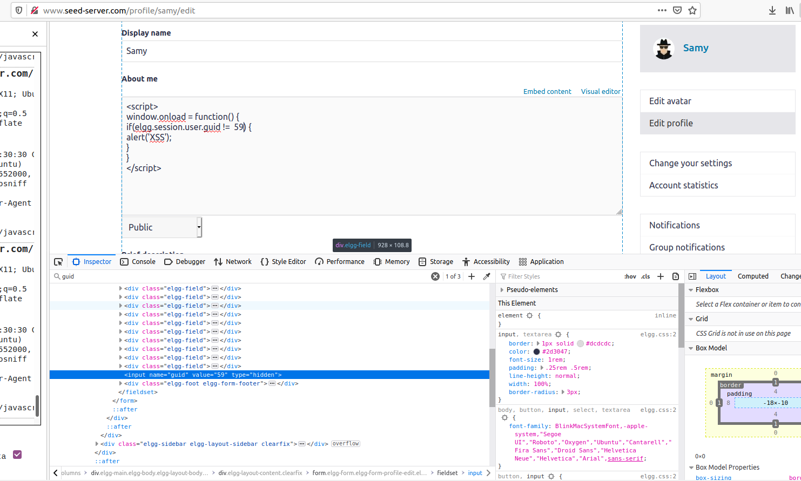

On the edit profile page, we start by finding the user ID (GUID), so we can
choose whose profile we want to target on our script. The script can be
injected on the "About Me" section of the edit profile page.

As a result, whenever an user opens this profile page, the following alert
window will pop-up.

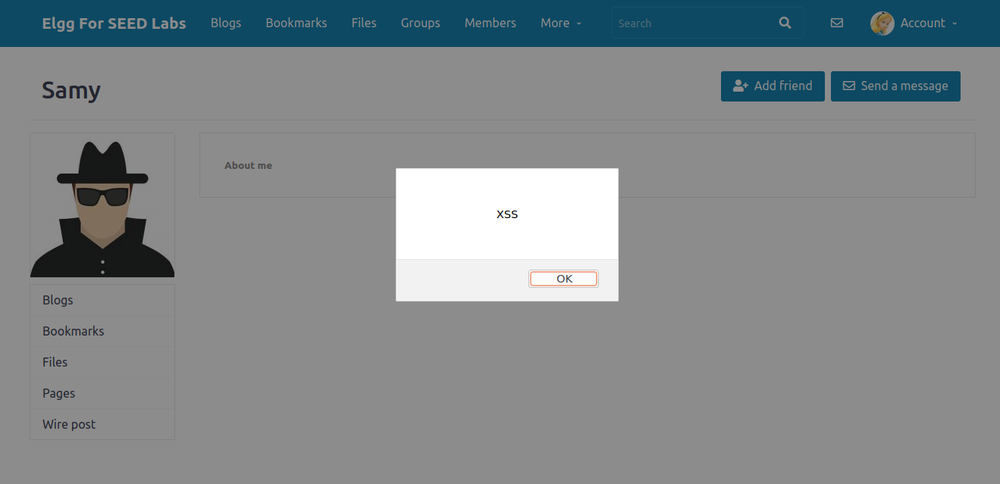

### Task 2

To post a malicious message to display cookies, the logic is the same. We
simply need to change our script so that, instead of returning an alert
windows, it prints the cookies.

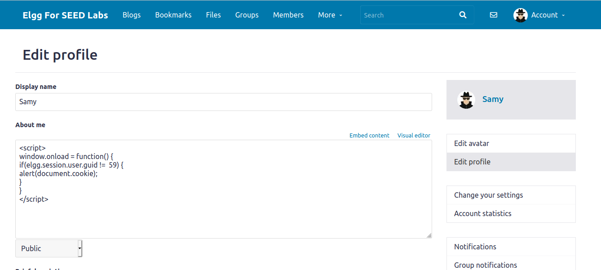

As a result, whenever an user opens this profile page, the current user's
cookies will be displayed.

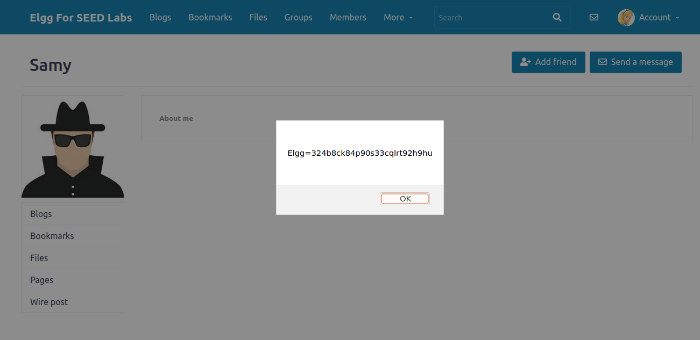

### Task 3

To steal cookies from the victim’s machine, we changed the script again. This
time a get request is sent to an address we control, containing said cookies

1. Injecting malicious script:

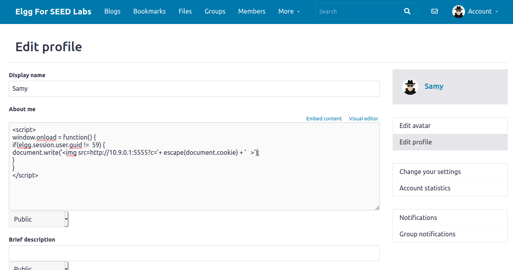

2. Setting up netcat listener:

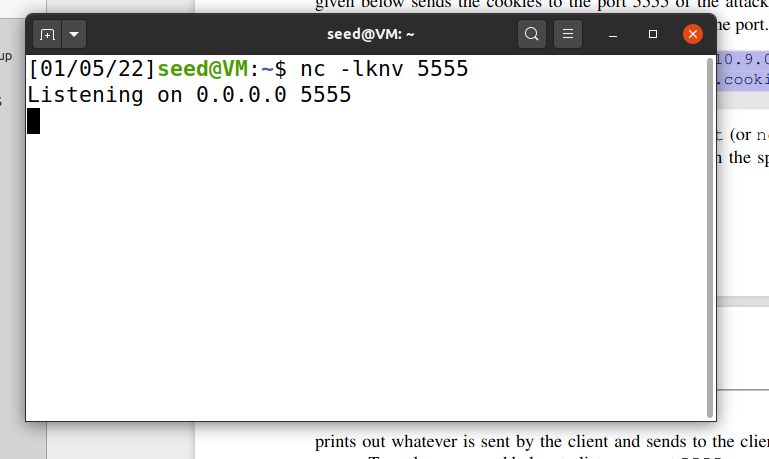

3. Accessing Samy's profile with the malicious code:

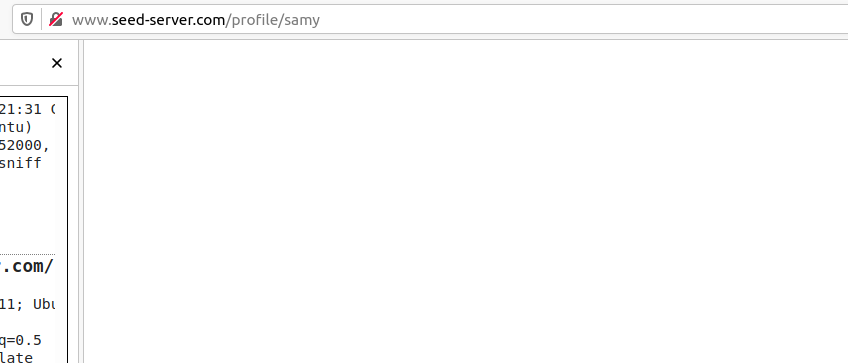

4. Request received with cookies:

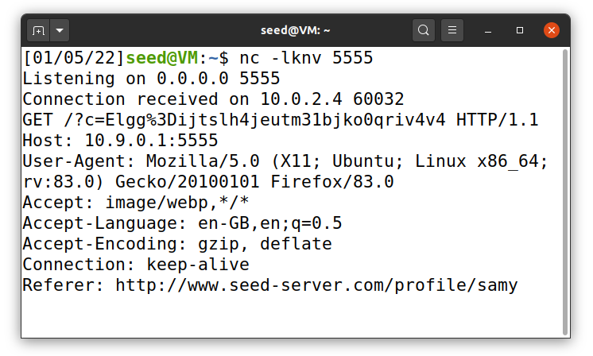

### Task 4

To become the victim’s friend we need to know the format of the add friend request.
The network tab on the browser's developer tools gives us that information.

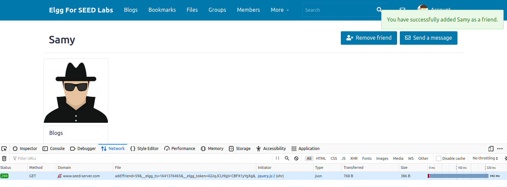

1. Injecting add friend script that uses the visitor's cookies:

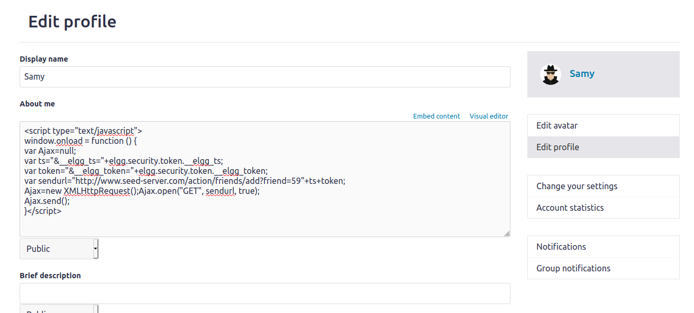

2. Alice's profile before visiting Samy's profile:

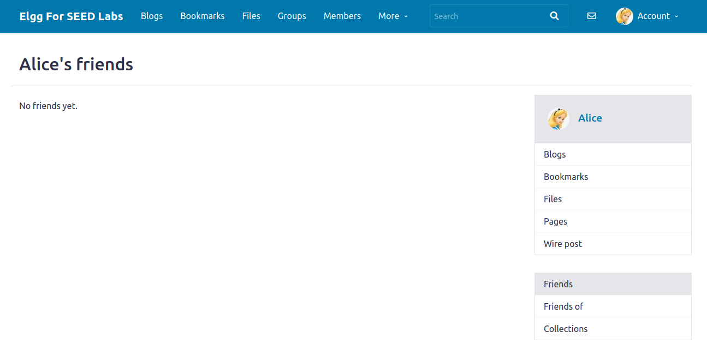

3. Alice's visiting Samy's profile (we can see in the developer tools a request
   has been sent):

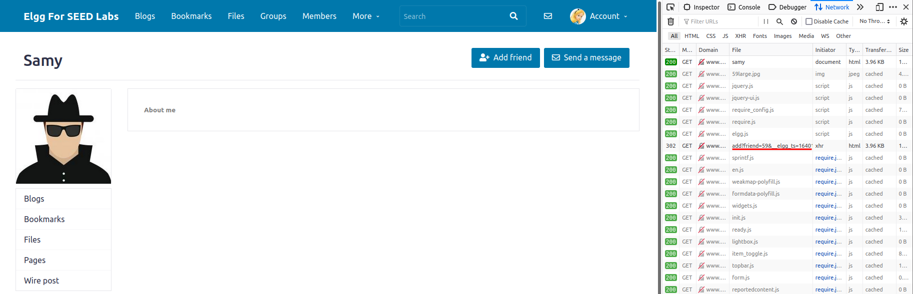

4. Alice's profile after visiting Samy's profile:

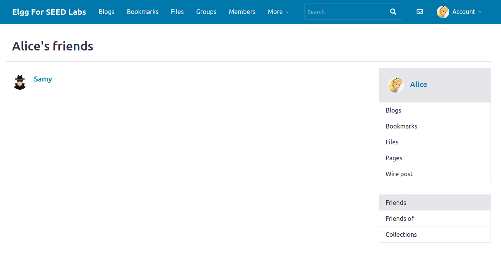
