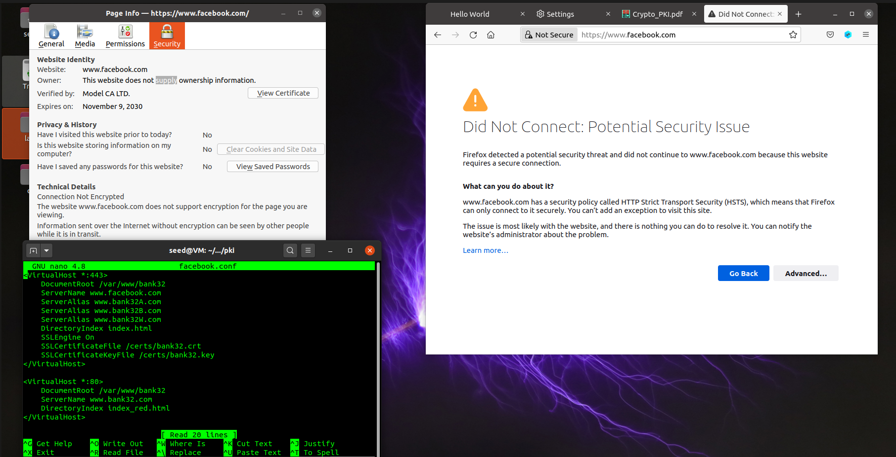

# LogBook11

## SEED Labs – PKI

### Task 1: Becoming a Certificate Authority (CA)

We started by copying the openssl.cnf from /etc/hosts to the lab folder and
uncommented the `unique_subject = no`. Following the guidelines, we created an
empty file **index.txt** and a file with a random number, **serial**.


To create a CA certificate we ran the following command:


To verify if the certificate is a CA's certificate, we have to look at
extensions section on the file. It should have a CA value, which should be TRUE
if is a CA's certificate or FALSE otherwise.

If the subject and the issuer of a certificate match, then we can say that it
is a self-signed certificate.

In the output of `openssl x509 -in ca.crt -text -noout`, once the extension's
CA value is TRUE, we can say that this is a CA's certificate. Also, since the
issuer and subject fields match, this indicates that is a self-signed
certificate.

<pre>
                                ...
<b>Issuer: CN = www.modelCA.com, O = Model CA LTD., C = US</b>
Validity
    Not Before: Jan 19 09:20:57 2022 GMT
    Not After : Jan 17 09:20:57 2032 GMT
<b>Subject: CN = www.modelCA.com, O = Model CA LTD., C = US</b>
                                ...
X509v3 extensions:
    X509v3 Subject Key Identifier: 
        22:5F:C8:04:71:2C:06:2E:1C:A9:8B:9C:E4:33:F6:B0:23:B0:9C:08
    X509v3 Authority Key Identifier: 
        keyid:22:5F:C8:04:71:2C:06:2E:1C:A9:8B:9C:E4:33:F6:B0:23:B0:9C:0
    X509v3 Basic Constraints: critical
        <b>CA:TRUE</b>
                                ...
</pre>

> In the RSA algorithm, we have a public exponent e, a private exponent d, a
> modulus n, and two secret numbers p and q, such that n = pq.

Since the decoded content had the numbers in hexadecimal we converted those to
integers. Conversion from hex using python:


```py
prime1 = 30741463591352440680857598944855847669849360459651171506367977855661863501939321229986516332123647024190926527663137778952596853373154166226839743283355025762873463849122866856944240880092498732400574076799461244926941389861581123286471924108324768766588759538765378874639077833124382134319630059571462452486929924010106150628008774595070667686419917366601895449033291909173351503717189251307171104906488400688633346792990495157041813497227632622574532260641085306685050543871111028722628103558190571689411445946913075532630018746323081962468940618212721321518705925708424020379685726047954041164371418892648835046419

prime2 = 24323822469084376067758596924919238167583989883129282528242639377465409255475412970906669290680850884363192806125501346972388122189005041759256911615352464806334293408619409975505615888220767649524028760196000088146853079408129031453055081522780936688137244968216435016111852588287156658004597601154798951673356328708098081289477006559204828468168521542628097337516124366560980031964566808817797368695942054958719734920735100433285867602290251366421712078005878493044634144641542227375027516866922295346508468035942380449209062760754863280177121589153894454467137077351852030890631514493751178240570232229947096377541

modulus = 747749902835877774546016117307693607064909252696054405594614951876454323842556588555247691569949800493108591299961050953577391754420714386950774775050602812424252147974852701032155046100924430402236867467343274721886469262988481528977315542967921369972122549649240017215777105768038014521854710748881701714436894910025247378092161858811021042125910015393879302334907319205688085999635174595336079564758795904565012706664105850268510137840609750181155265124951193533854628395520961481948993766232130842667707546276122586578687778700253440333177179607775351003981091279759762722048151340514988116637504205640057259525285736364953259525995505671360334694010035539690181428947375713107612655185258807174724493802876794065418938086310752730528651958846527209541135916800922886433303123808098241833780340052824225027510756747567627848942509908283889849903822010984978445902908116335744594626616341361359165849444821930574188978079829433010352261459573668511058638195501981815614133994641669856739417246657833791688653806096860700178565049029923476743906687785731267194049717178901254923622808838093522001343666367939698357866100384354302965577157449289024427177909606090385132480530970219994499871131675119062368230834826064608081484075679

if(prime1 * prime2 == modulus):
  print("OK")
```

Confirming the integrity:


### Task 2: Generating a Certificate Request for Your Web Server

A certificate signing request is done by executing the line below:


To add different alternative DNS, we use the following command:

```sh
openssl req -newkey rsa:2048 -sha256 -keyout server.key -out server.csr     
-subj "/CN=www.bank32.com/O=Bank32 Inc./C=US" -passout pass:dees             
-addext "subjectAltName = DNS:www.bank32.com, DNS:www.bank32A.com,DNS:www.bank32B.com"
```
We can see in the image below, that the three subject alternative names were
added correctly.


### Task 3: Generating a Certificate for your server

```sh
openssl ca -config openssl.cnf -policy policy_anything -md sha256 -days 3650 -in server.csr -out server.crt -batch -cert ca.crt -keyfile ca.key
```

This command turns the CSR into a X509 certificate, using the CA's certificate
and key. We can see that the server.crt is no longer a CA certificate:
<pre>
Certificate Details:
    Serial Number: 4097 (0x1001)
    Validity
        Not Before: Jan 21 19:27:14 2022 GMT
        Not After : Jan 19 19:27:14 2032 GMT
    Subject:
        countryName               = US
        organizationName          = Bank32 Inc.
        commonName                = www.bank32.com
    X509v3 extensions:
        X509v3 Basic Constraints: 
            <b>CA:FALSE</b>
                            ...
</pre>

Uncommenting `copy_extensions`:


```sh
openssl x509 -in server.crt -text -noout
```

After uncommenting the copy extensions variable on the openssl file and running
the shell code above, we can see that the alternative DNS are still available
to use.

<pre>
Certificate:
    Data:
                            ...
        X509v3 extensions:
            X509v3 Basic Constraints: 
                CA:FALSE
            Netscape Comment: 
                OpenSSL Generated Certificate
            X509v3 Subject Key Identifier: 
                20:45:DA:74:79:2A:E1:9A:44:27:9C:84:5D:94:D2:5A:93:EA:09:63
            X509v3 Authority Key Identifier: 
                keyid:9D:2F:50:52:9F:73:5F:BE:51:FF:4E:2C:BE:B8:8F:82:76:5B:1A:38

            X509v3 Subject Alternative Name: 
                <b>DNS:www.bank32.com, DNS:www.bank32A.com, DNS:www.bank32B.com</b>
                            ...
</pre>
### Task 4: Deploying Certificate in an Apache-Based HTTPS Website

Using the files already given in the Labsetup docker container (a custom
website will be done on the following tasks) we will setup the
[bank32](https://www.bank32.com) domain over https.

Both the `index_red.html` and the `index.html` for http and https
correspondingly, are copied to `/var/www/bank32`. The ssl configuration and the
certificate and key of the server are placed in their correct locations.

This can be seen by looking at the Dockerfile:

```docker
FROM handsonsecurity/seed-server:apache-php

ARG WWWDIR=/var/www/bank32

COPY ./index.html ./index_red.html $WWWDIR/
COPY ./bank32_apache_ssl.conf /etc/apache2/sites-available
COPY ./certs/bank32.crt ./certs/bank32.key  /certs/

RUN  chmod 400 /certs/bank32.key \
     && chmod 644 $WWWDIR/index.html \
     && chmod 644 $WWWDIR/index_red.html \
     && a2ensite bank32_apache_ssl   

CMD  tail -f /dev/null
```

After this, the following command must be ran to start apache:

```sh
service apache2 start
```

Accessing the http domain, leads us to the following website:


However when accessing it using https, we have this warning message:


This happens because the Certificate Authority is not trusted by the browser,
to solve this, we need to add the CA's certificate to the trusted certificates
in the browser.

On firefox's settings, on the Privacy & Security tab, we can import a certificate:


After this we can see that the site is now trusted. That verification is
done by the CA that we created:


### Task 5: Launching a Man-In-The-Middle Attack

**Step 1: Setting up the malicious website**

On this task we will try to impersonate facebook's website.
To do this we change the Apache's configuration file ServerName:

```
<VirtualHost *:443> 
    DocumentRoot /var/www/bank32
    ServerName www.facebook.com
    DirectoryIndex index.html
    SSLEngine On 
    SSLCertificateFile /certs/bank32.crt
    SSLCertificateKeyFile /certs/bank32.key
</VirtualHost>

<VirtualHost *:80> 
    DocumentRoot /var/www/bank32
    ServerName www.bank32.com
    DirectoryIndex index_red.html
</VirtualHost>

# Set the following gloal entry to suppress an annoying warning message
ServerName localhost
```

**Step 2: Becoming the man in the middle**

In order to simulate a DNS poisining attack, the following entry was added to `/etc/hosts`:

`10.9.0.80 www.facebook.com`

This redirects the domain to our server, which is could be running a fake
facebook. The entries on `/etc/hosts` are prioritized over asking DNS servers.
So when we try to access `www.facebook.com`, the redirection is to our website,
instead of the real one.

**Step 3: Browse the target website**

When trying to browse, we are presented with a warning, displaying that there
could be a potential security issue. We don't have neither facebook's key nor
certificate, and we also haven't signed any certificate request by the
name`www.facebook.com` so our CA can't verify the connection, deeming it as not
secure. This successfully prevents MITM attacks.



### Task 6: Launching a Man-In-The-Middle Attack with a Compromised CA

Here we pretend that the key of a CA which was stolen. This allows us to sign
any certificate using that CA's key,

Assuming that the CA we created was a root CA, so we already have it's key, we
can demonstrate the implications of the key leaking.

Root CA's are already loaded by default into the browser's trusted certificates
list. Which means all we have to do is sign a certificate with the rootCA, and
redirect it to our server. Following the steps from the previous tasks, we
created a certificate request in the name of facebook, and signed it using our
CA's key.

Now, there is no distinction between the site we signed and the real one, from
the browser's prespective, the one which will be loaded is the one where the
DNS points to. If the DNS has been poisoned to lookup the ip of our fake
server, the fake server will be loaded over https, with no errors/warnings
displayed to warn the user of a potential security risk.

The index.html can be changed to look similar to the original website, we
copied the index from facebook, without any styling used:


