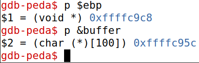

# LogBook5

## SEED Labs – Buffer Overflow Attack Lab (Set-UID Version)

### Task 1

Both files execute a new shell terminal.

### Task 2

Here we compile the binary, assign it's owner to root through the chown call.
Then give it the Set-UID bit which is the starting number 4 on the chmod call.

### Task 3

- *offset*

We need to know the offset from the begginning of the buffer to the return
address, so we can overwrite it. Knowing both the addresses of the base pointer
(top of the stack when the function is called) and the buffer's starting address.
We can calculate the difference between them:

0xffffc9c8 - 0xffffc95c = 0x6c (108 in decimal)

This is interesting because, from being familiar with the stack layout, we know
that the return address is stored exactly after the base pointer, which means
that the next address, will be the return address.  On a 32 bit architecture we
need to add 4 bytes to the previously calculated value. This gives us 112 bytes
of distance between the buffer and the return address.

- *shellcode*

The shellcode used was the same as showed on the seedlab tutorial guide. Since
the binary is compiled for a 32 bit architecture, the shellcode for that
specific architecture must be used.

- *start*

Start variable determines where the beggining of the shellcode will be placed
on the 517 bytes of the overflowed buffer, this could be placed anywhere as
long as it's after the overwriten return address (between byte 116 and 517).
Since we want to maximize the success rate of the exploit, we put the shellcode
on the very end. This gives us leverage room to hit the NOP slide. From byte
116 to the beggining of the shellcode there will be more than 300 bytes where,
if the return address hits, will slide through the NOP's and into the
shellcode, returning our root shell. Making it more likely that the return
address will point to one of the No Operation instructions, even with slight
movement of the stack on different executions

- *ret*

Here we have the address that will overwrite the previous return address, when
the function returns, it will return to the address that we provided instead of
the correct one. This varies from machine to machine but, what is known, is
that the NOP slide is somewhere above the return address on the stack.
Sometimes the script may even be successful on gdb, but not when actually
running it directly. Since gdb also pushes values onto the stack that help
simplify the debbugging process, the stack will won't be exactly the same when
running without the gdb. This is where the previous wiggle room comes in, since
we have more than 300 bytes where we can land on a NOP, by adding an offset to
the ebp + 4 (return address), we will eventually hit a NOP, on this case a
working offset was 200 bytes starting from the base pointer.

It should also be noted that this return address shouldn't contain any byte
filed with 0's (0x00). Otherwise the strcpy function will stop copying when it
hits that null byte, and the rest of the payload won't be copied.

Exploit used:

Root shell obtained:

